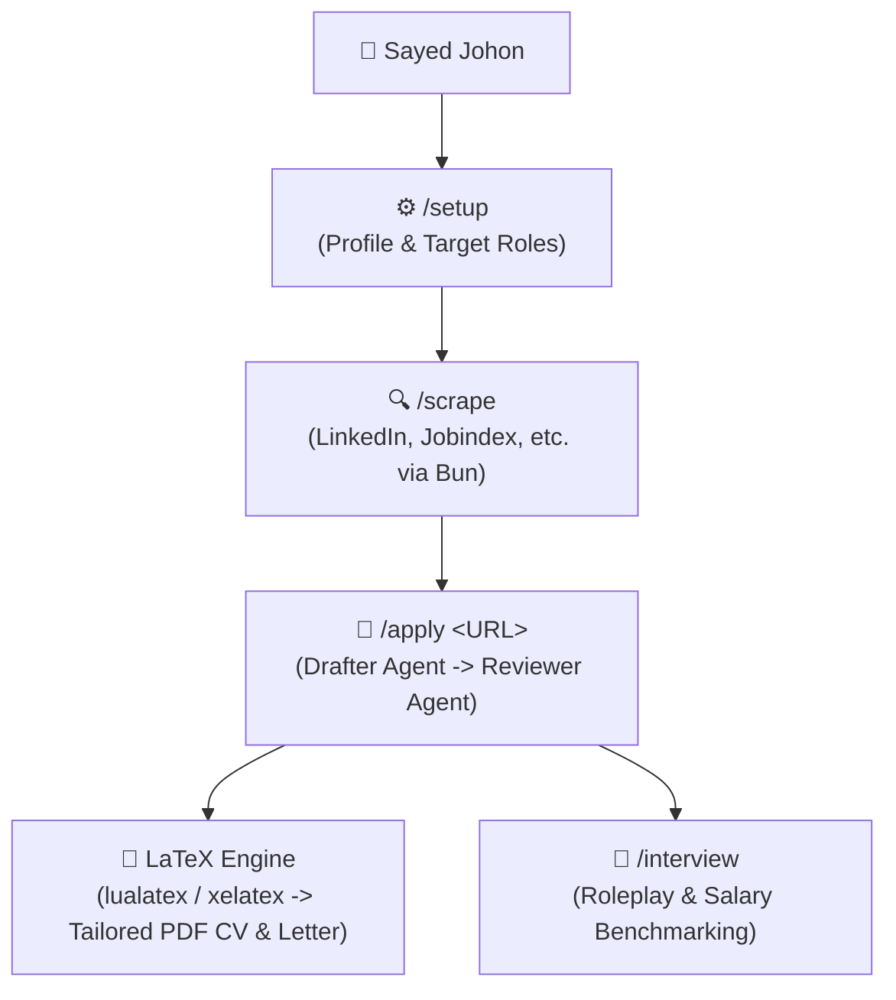

# 🤖 Sub-Project Log: AI Job Search

## 🧭 Architecture & Execution Flow Map

### ⚡ Sub-Project Profile & Workload Assessment

* **Compute Intensity**: **Lightweight (Low Workload)**.
  - Consists of lightweight CLI scraping (via `bun`), LaTeX template compilation (`lualatex`/`xelatex`), Python salary data lookups, and LLM text generation.
  - Can easily run 100% on the local macOS host without burdening CPU/GPU.
  - **Remote Linux Offload Option**: If mass headless portal scraping or 24/7 cron scraping is required, the scraper scripts can be dispatched to `joe@100.86.193.4` or run inside a Docker container.

### 🗂️ Component Directory Map

* **Candidate Profile Source of Truth**: [`CLAUDE.md`](../CLAUDE.md) & [`.claude/skills/job-application-assistant/`](../.claude/skills/job-application-assistant/)
* **Portal Search Skills**: [`.agents/skills/`](../.agents/skills/) (e.g. `linkedin-search`, `jobindex-search`)
* **CV & Cover Letter Templates**: [`templates/`](../templates/), [`cv/`](../cv/), [`cover_letters/`](../cover_letters/)
* **Salary Benchmark Tool**: [`salary_lookup.py`](../salary_lookup.py)
* **Testing Suite**: [`tests/`](../tests/)

---

## 📜 Sub-Project Change Log

- **2026-08-20**: Initialized and cloned `ai-job-search` from upstream `MadsLorentzen/ai-job-search`. Completed compute-workload assessment (Lightweight/local Mac capable) and established sub-app project log.
