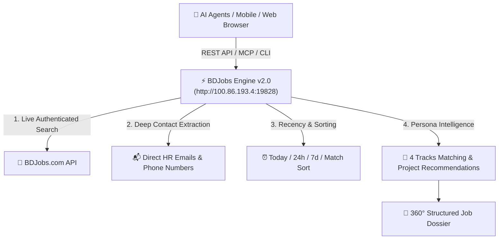

# 🇧🇩 BDJobs Enterprise Engine & MCP Guide (v2.0)

This guide documents the enterprise-grade **BDJobs Research & Scraping Engine** built for **Hamim Ahmed (Sayed Johon)**.

---

## ⚡ Architecture & Capabilities



### 🌟 Key Enterprise Features:
1. **📬 100% Direct Contact Extraction**:
   - Automatically parses `ApplyEmail`, `JobAppliedEmail`, `ApplyInstruction`, `JobDescription`, and `AdditionJobRequirements`.
   - Identifies whether the application is **DIRECT_EMAIL**, **ONLINE**, **EXTERNAL_URL**, or **WALK_IN**.
   - Captures all recruiter emails and direct HR contact phone numbers.
2. **⏰ Freshness & Recency Ranking**:
   - Filter by recency (`jobage=1` for jobs posted today in the last 24 hours, `jobage=7` for the past week).
   - Sort by `latest` (newest first), `match` (highest persona match score), or `deadline` (closing soonest).
3. **🎯 4 Persona Track AI Scoring (0–100%)**:
   - **Track A: AI Systems & Automation Engineer** (Python, FastAPI, RAG, n8n, Supabase).
   - **Track B: Media Production & Video Director** (DaVinci Resolve, Premiere Pro, Cinematography, YouTube).
   - **Track C: Growth Marketing & Copywriting** (Audience psychology, CRO, social automation, KDP).
   - **Track D: Technical Generalist / Startup Lead** (0-to-1 founder execution, MicTab, PeeAI).
   - Automatically recommends which specific projects from your dossier to feature on your CV.

---

## 🌐 1. REST API Reference (`http://100.86.193.4:19828`)

### 🩺 Health & Session Status
```bash
curl http://100.86.193.4:19828/health
```

### 🔍 Search Jobs
| Parameter | Type | Description | Example |
| :--- | :--- | :--- | :--- |
| `q` | `string` | Keywords (role / skills) | `python`, `video editor` |
| `category` | `string` | Category alias | `it`, `media`, `marketing`, `creative`, `management` |
| `location` | `string` | District / Location | `Dhaka`, `Remote` |
| `jobage` | `int` | Recency filter (days) | `1` (last 24h), `7` (last week) |
| `sort` | `string` | Sorting order | `latest`, `match`, `deadline` |
| `limit` | `int` | Results count (1-50) | `10` |

**Example URL:**
```
http://100.86.193.4:19828/search?q=video&category=media&sort=match&limit=5
```

### 📌 Full 360° Job Dossier & Contact Extraction
```bash
curl http://100.86.193.4:19828/detail/1523323
```
**Sample JSON Response:**
```json
{
  "id": "1523323",
  "title": "Farm Supervisor (Resident)",
  "company": "Farm House",
  "contacts": {
    "applicationMethod": "direct_email",
    "primaryEmail": "spmlhr058@gmail.com",
    "allEmails": ["spmlhr058@gmail.com"],
    "phoneNumbers": []
  },
  "aiPersonaMatching": {
    "bestPersonaTrack": "Track D: Technical Generalist / Startup Lead",
    "matchScore": 25,
    "featuredProjects": ["Founder of MicTab.com & PeeAI.com"],
    "cvTailoringAdvice": "Lead with 0-to-1 founder execution..."
  }
}
```

---

## 💻 2. Fast CLI Commands

```bash
# 1. Search for Python & AI jobs posted in the last 24h (Track A)
bun run .agents/skills/bdjobs-search/cli/src/cli.ts search -q "python" -c "it" --jobage 1 --sort match --format table

# 2. Search for Media & Video roles sorted by highest persona match
bun run .agents/skills/bdjobs-search/cli/src/cli.ts search -q "video" -c "media" --sort match --format table

# 3. Pull deep 360° research dossier (including recruiter email & tailoring advice)
bun run .agents/skills/bdjobs-search/cli/src/cli.ts detail 1522795 --format plain
```

---

## 🤖 3. Universal MCP Server Setup (For AI Agents & IDEs)

Add this entry to your `mcpServers` configuration in Antigravity, Claude Desktop, or Cursor:

```json
{
  "mcpServers": {
    "bdjobs": {
      "command": "python3",
      "args": [
        "/Users/sayedjohon/Documents/DEV_AREA/#1 Playground/ai-job-search/tools/bdjobs_mcp_server.py"
      ]
    }
  }
}
```

### Tools Exposed to Agents:
* `bdjobs_search(query, category, location, jobage, sort, limit)`
* `bdjobs_research_job(job_id)`
* `bdjobs_get_categories()`

---

## 🛠️ 4. Managing the 24/7 Linux Daemon

```bash
# Check status
ssh joe@100.86.193.4 "pm2 status"

# View live traffic logs
ssh joe@100.86.193.4 "pm2 logs bdjobs-api"

# Restart
ssh joe@100.86.193.4 "pm2 restart bdjobs-api"
```
