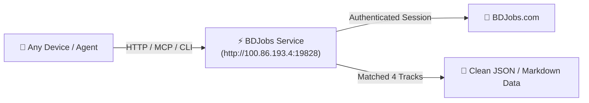

# 🇧🇩 BDJobs API, CLI & MCP Complete Guide

This guide explains how to use, test, and trigger the **BDJobs Scraping Engine** from anywhere (Browser, Terminal, Mac, Linux, or AI Agents).

---

## ⚡ What Was Built



1. **24/7 Background Microservice**: Runs under PM2 on Linux (`http://100.86.193.4:19828`).
2. **Native Bun CLI Skill**: Integrates with `/scrape` in `ai-job-search/.agents/skills/bdjobs-search/`.
3. **Universal MCP Server**: `tools/bdjobs_mcp_server.py` for AI agents (Antigravity, Claude, Cursor).
4. **4 Persona Track Auto-Mapping**: Every job automatically tags into Track A, B, C, or D.

---

## 🌐 1. REST API (Browser or Any App)

The service is accessible at `http://100.86.193.4:19828`.

### 🩺 Health Check
Open in your browser or curl:
```bash
curl http://100.86.193.4:19828/health
```
**Response:**
```json
{
  "status": "healthy",
  "cookiesLoaded": true,
  "service": "BDJobs Scraper API",
  "host": "joe@100.86.193.4",
  "targetUser": "Sayed Johon (hello.sayedjohon@gmail.com)"
}
```

### 🔍 Search Jobs
```bash
# Search by keyword
curl "http://100.86.193.4:19828/search?q=python&limit=5"

# Search with category (it, media, marketing, etc.)
curl "http://100.86.193.4:19828/search?q=video&category=media&limit=5"
```

### 📌 Get Full Job Details
```bash
curl "http://100.86.193.4:19828/detail/1522795"
```
Returns: Title, Company, Description, Requirements, Skills, Salary, Benefits, Workplace, and Deadline.

---

## 💻 2. Terminal CLI (Mac & Linux)

You can run these fast CLI commands inside `ai-job-search`:

```bash
# Search for AI & Software roles (Track A)
bun run .agents/skills/bdjobs-search/cli/src/cli.ts search -q "python" -c "it" --format table

# Search for Video & Media roles (Track B)
bun run .agents/skills/bdjobs-search/cli/src/cli.ts search -q "video" -c "media" --format table

# View full job requirements in human-readable format
bun run .agents/skills/bdjobs-search/cli/src/cli.ts detail 1522795 --format plain
```

---

## 🤖 3. MCP Configuration (For AI Agents & IDEs)

To connect this to **Antigravity**, **Claude Desktop**, or **Cursor**, add this to your MCP configuration:

```json
{
  "mcpServers": {
    "bdjobs": {
      "command": "python3",
      "args": [
        "/Users/sayedjohon/Documents/DEV_AREA/#1 Playground/ai-job-search/tools/bdjobs_mcp_server.py"
      ]
    }
  }
}
```

### Available MCP Tools:
* `bdjobs_search`: Query jobs by keyword, category, location, limit.
* `bdjobs_get_job_detail`: Pull requirements, salary, and company description by Job ID.
* `bdjobs_get_categories`: List category mappings to your 4 Persona Tracks.

---

## 🛠️ 4. Managing the 24/7 Linux Service

The service runs permanently on your Linux box (`joe@100.86.193.4`).

```bash
# Check status
ssh joe@100.86.193.4 "pm2 status"

# View live logs
ssh joe@100.86.193.4 "pm2 logs bdjobs-api"

# Restart service
ssh joe@100.86.193.4 "pm2 restart bdjobs-api"
```

---

## 🎯 5. The 4 Persona Track Mapping

| BDjobs Category | Category Code | Auto-Assigned Persona Track |
| :--- | :--- | :--- |
| **IT / Software / Telecommunication** | `8` (`it`, `software`, `ai`) | **Track A: AI Systems & Automation Engineer** |
| **Media / Event / Advertisement** | `10` (`media`) | **Track B: Media Production & Video Director** |
| **Design / Creative / Graphics** | `18`, `71` (`creative`) | **Track B: Media Production & Video Director** |
| **Marketing / E-Commerce / Sales** | `9`, `30` (`marketing`) | **Track C: Growth Marketing & Copywriting** |
| **Management / Admin / Consulting** | `7`, `13` (`management`) | **Track D: Technical Generalist / Startup Lead** |
