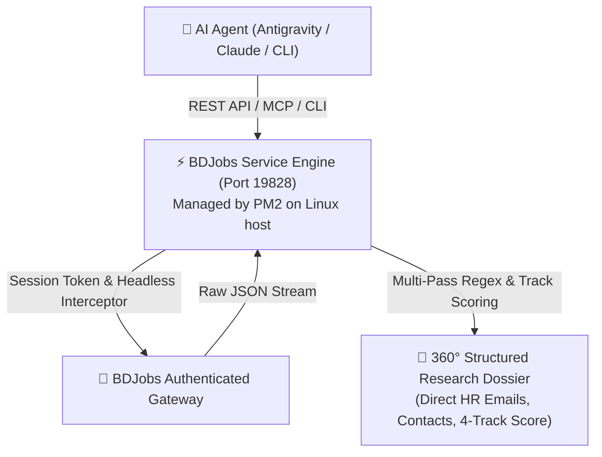

# 🇧🇩 BDJobs Master Agent Manual & API/MCP Reference
> **Zero-Hallucination Source of Truth** for AI Agents, Developers, and Automated Job Pipelines.
> **Owner / Candidate**: Hamim Ahmed (Sayed Johon) | `hello.sayedjohon@gmail.com` | Dhaka, Bangladesh

---

## ⚡ 1. System Architecture & 24/7 Deployment

The BDJobs engine runs permanently on the dedicated Linux host (`joe@100.86.193.4`). Any agent on Mac, Linux, or Cloud can query it with zero browser overhead.



* **Live API Base URL**: `http://100.86.193.4:19828`
* **Daemon Process**: `pm2 status` -> `bdjobs-api` (Auto-restarts on server reboot)
* **MCP Server Script**: `tools/bdjobs_mcp_server.py`
* **Bun CLI Tool**: `.agents/skills/bdjobs-search/cli/src/cli.ts`
* **Session Source**: `assets/cookies_bdjobs.com.txt`

---

## 🌐 2. Complete REST API Specifications

### `GET /health`
Verifies server health and session token validity.
* **URL**: `http://100.86.193.4:19828/health`
* **Response**:
```json
{
  "status": "healthy",
  "cookiesLoaded": true,
  "service": "BDJobs Enterprise Engine v2.0",
  "host": "joe@100.86.193.4",
  "targetUser": "Sayed Johon (hello.sayedjohon@gmail.com)",
  "capabilities": ["deep_contact_extraction", "recency_ranking", "4_track_persona_scoring"]
}
```

---

### `GET /search`
Searches thousands of active job listings with multi-criteria filtering and instant Persona Match scoring.

* **URL**: `http://100.86.193.4:19828/search`
* **Query Parameters**:
  | Parameter | Type | Required? | Description & Allowed Values | Example |
  | :--- | :--- | :--- | :--- | :--- |
  | `q` | `string` | Optional | Keyword, skill, or exact title | `python`, `video editor`, `fastapi` |
  | `category` | `string` | Optional | Category alias or numeric code | `it`, `media`, `creative`, `marketing`, `management`, `8` |
  | `location` | `string` | Optional | District, city, or work mode | `Dhaka`, `Chittagong`, `Remote`, `Work from home` |
  | `jobage` | `integer` | Optional | Recency filter in days | `1` (Posted today/24h), `7` (Past week), `30` (Month) |
  | `sort` | `string` | Optional | Sorting order | `latest` (Default), `match` (Best fit), `deadline` |
  | `page` | `integer` | Optional | Pagination page (1-indexed) | `1`, `2`, `3` |
  | `limit` | `integer` | Optional | Results per page (1 to 50) | `10`, `20` |

* **Sample Response**:
```json
{
  "count": 1,
  "page": 1,
  "limit": 10,
  "sortBy": "latest",
  "results": [
    {
      "id": "1522795",
      "title": "Senior Python Developer",
      "company": "Luminous Labs",
      "location": "Dhaka (DOHS Mirpur)",
      "deadline": "Aug 27, 2026",
      "deadlineDB": "2026-08-27T00:00:00Z",
      "publishDate": "2026-08-17T10:40:00Z",
      "salary": "Tk. 50000 - 80000 (Monthly)",
      "experience": "4 to 8 years",
      "education": "BSc / MSc in Computer Science",
      "url": "https://bdjobs.com/h/details/1522795?ln=1",
      "personaTrack": "Track A: AI Systems & Automation Engineer",
      "matchScore": 65,
      "matchedKeywords": ["python", "fastapi", "backend", "docker", "postgresql"],
      "featuredProject": "MicTab Desktop Voice Agent"
    }
  ]
}
```

---

### `GET /detail/{job_id}`
Returns a comprehensive **360° Job Research Dossier**, extracting direct recruiter emails, phone numbers, application methods, required skills, and tailored CV recommendations.

* **URL**: `http://100.86.193.4:19828/detail/{job_id}`
* **Path Parameter**: `job_id` (Numeric ID from search, e.g. `1522795` or `1523323`).
* **Sample Response**:
```json
{
  "id": "1523323",
  "title": "Farm Supervisor (Resident)",
  "company": "Farm House",
  "location": "Dhaka",
  "workplace": "Work at office",
  "jobNature": "Contractual",
  "postedOn": "Aug 20, 2026",
  "deadline": "Sep 17, 2026",
  "vacancies": "1",
  "compensation": {
    "salaryRange": "Negotiable",
    "minSalary": null,
    "maxSalary": null,
    "benefits": "Standard company benefits"
  },
  "contacts": {
    "applicationMethod": "direct_email",
    "primaryEmail": "spmlhr058@gmail.com",
    "allEmails": ["spmlhr058@gmail.com"],
    "phoneNumbers": [],
    "applicationInstructions": "Send your CV to the given email spmlhr058@gmail.com",
    "applyUrl": "https://bdjobs.com/h/details/1523323?ln=1"
  },
  "requirements": {
    "education": "Diploma in Agriculture",
    "experience": "3 to 4 years",
    "additionalRequirements": "Age 25 to 35 years",
    "hardSkills": [],
    "suggestedSkills": ["Farm Management", "Supervision"]
  },
  "description": "Full job description text...",
  "aiPersonaMatching": {
    "bestPersonaTrack": "Track D: Technical Generalist / Startup Lead",
    "matchScore": 25,
    "featuredProjects": ["Founder of MicTab.com & PeeAI.com", "0-to-1 Product Ownership & Scaling"],
    "cvTailoringAdvice": "Lead with 0-to-1 founder execution, operational leadership, and cross-functional execution."
  },
  "url": "https://bdjobs.com/h/details/1523323?ln=1"
}
```

---

## 🤖 3. Universal MCP Server Setup (For Any AI Agent)

Equip Antigravity, Claude Desktop, Cursor, or any MCP client by adding this configuration:

```json
{
  "mcpServers": {
    "bdjobs": {
      "command": "python3",
      "args": [
        "/Users/sayedjohon/Documents/DEV_AREA/#1 Playground/ai-job-search/tools/bdjobs_mcp_server.py"
      ]
    }
  }
}
```

### Exposed MCP Tools Schema:
1. `bdjobs_search`:
   - `query` *(string)*: Search keywords
   - `category` *(string)*: `it` | `media` | `marketing` | `creative` | `management`
   - `location` *(string)*: `Dhaka` | `Remote`
   - `jobage` *(integer)*: `1` (last 24h) | `7` (last week)
   - `sort` *(string)*: `latest` | `match` | `deadline`
   - `limit` *(integer)*: 1 to 50
2. `bdjobs_research_job`:
   - `job_id` *(string)*: Numeric job ID or full URL
3. `bdjobs_get_categories`:
   - Returns full category code and track dictionary.

---

## 💻 4. Bun CLI Quick Reference

```bash
# 1. Search for AI & Python roles (Track A)
bun run .agents/skills/bdjobs-search/cli/src/cli.ts search -q "python" -c "it" --format table

# 2. Search for Media & Video Creator roles sorted by match (Track B)
bun run .agents/skills/bdjobs-search/cli/src/cli.ts search -q "video" -c "media" --sort match --format table

# 3. Pull deep research dossier & recruiter email
bun run .agents/skills/bdjobs-search/cli/src/cli.ts detail 1523323 --format plain
```

---

## 🎭 5. The 4 Persona Tracks (Agent Decision Matrix)

When an AI Agent evaluates a job posting, it MUST assign it to ONE of the following 4 Persona Tracks:

### 🔹 Track A: AI Systems & Automation Engineer
* **Target Roles**: AI Engineer, Backend Developer, Python Developer, Automation Lead, Full-Stack AI.
* **BDJobs Category**: `8` (`it`, `software`, `ai`).
* **Key Strengths to Highlight**: Custom business AI pipelines, MicTab Desktop Voice Agent, AutometaBot RAG support engine (`pgvector`), n8n enterprise workflows, FastAPI, Docker, PostgreSQL.

### 🔹 Track B: Media Production & Video Director
* **Target Roles**: Video Editor, Creative Director, YouTube Channel Lead, Cinematographer, Content Creator.
* **BDJobs Category**: `10` (`media`), `18` (`creative`), `71` (`graphics`).
* **Key Strengths to Highlight**: On-camera host of JunoverseAI on YouTube, Canon 5D Mark III + 70-200mm f/2.8L IS II optics, 3-second hook retention craft, DaVinci Resolve node color grading & Fairlight audio, Adobe Premiere Pro & After Effects.

### 🔹 Track C: Growth Marketing & Copywriting
* **Target Roles**: Growth Marketer, Digital Marketing Specialist, Copywriter, Social Automation Lead.
* **BDJobs Category**: `9` (`marketing`), `30` (`ecommerce`, `digital_marketing`).
* **Key Strengths to Highlight**: Consumer audience psychology, high-converting copywriting, AutometaBot social DM/comment funnel automation, Conversion Rate Optimization (CRO), Amazon KDP publishing.

### 🔹 Track D: Technical Generalist / Startup Lead
* **Target Roles**: Technical Product Lead, Operations Lead, Founder's Associate, Project Manager.
* **BDJobs Category**: `7` (`management`), `13` (`consultancy`, `research`).
* **Key Strengths to Highlight**: Founder of MicTab.com & PeeAI.com, 0-to-1 product ownership, rapid agency workflow automation, fluent English on-camera presenter.

---

## 🛠️ 6. Linux Daemon Health & Management

The service runs 24/7 on the Linux host (`joe@100.86.193.4`).

```bash
# Check if service is online
ssh joe@100.86.193.4 "pm2 status bdjobs-api"

# View live traffic logs
ssh joe@100.86.193.4 "pm2 logs bdjobs-api --lines 50"

# Restart service after any config update
ssh joe@100.86.193.4 "pm2 restart bdjobs-api"
```
